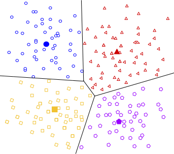

# K-Means-Clustering

**Centroid-based Clustering**

Centroid-based clustering organizes the data into non-hierarchical clusters, in contrast to hierarchical clustering defined below. k-means is the most widely-used centroid-based clustering algorithm. Centroid-based algorithms are efficient but sensitive to initial conditions and outliers. This course focuses on k-means because it is an efficient, effective, and simple clustering algorithm.

**Density-based Clustering**

Density-based clustering connects areas of high example density into clusters. This allows for arbitrary-shaped distributions as long as dense areas can be connected. These algorithms have difficulty with data of varying densities and high dimensions. Further, by design, these algorithms do not assign outliers to clusters.

**Distribution-based Clustering**

This clustering approach assumes data is composed of distributions, such as Gaussian distributions. In figure, the distribution-based algorithm clusters data into three Gaussian distributions. As distance from the distribution's center increases, the probability that a point belongs to the distribution decreases. The bands show that decrease in probability. When you do not know the type of distribution in your data, you should use a different algorithm.

